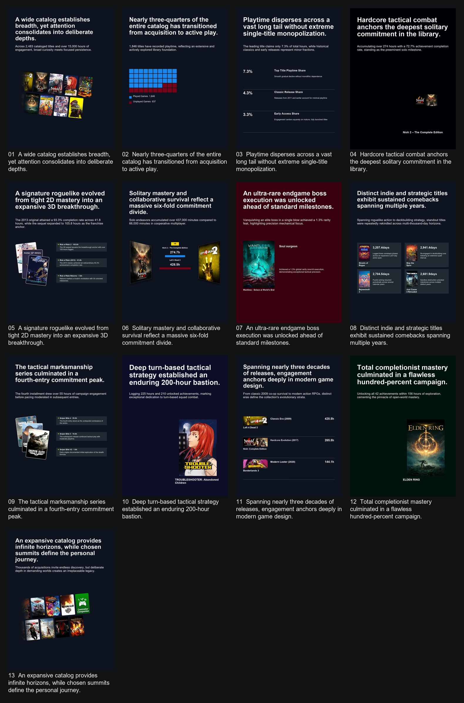

# Steam Visualogue

[简体中文](README.zh-CN.md)

Turn a Steam library snapshot into a curated, reader-facing visual essay and data-driven portrait.

Example output:



---

## Prerequisites & Setup

### 1. Steam Web API Key
1. Obtain your API key from the [Steam Community Developer Portal](https://steamcommunity.com/dev/apikey) (domain name can be `localhost`).
2. Create a file named `.steam-visualogue.env` in the repository root directory:
   ```env
   STEAM_API_KEY=your_32_character_api_key_here
   ```

### 2. Install Python Dependencies
Requires Python 3.10+. Install the required packages via:

```bash
pip install -r .agents/skills/steam-visualogue/scripts/requirements.txt
```

---

## Example Prompts

Simply instruct your agent with prompts such as:

  > *"Generate a Steam Visualogue report for user `XXXXX` (your steam ID or profile URL) in English."*

The agent will automatically execute the analysis, editorial curation, palette extraction, rendering, and quality gates, outputting the finalized deck and contact sheets under `output/<run-name>/`.
