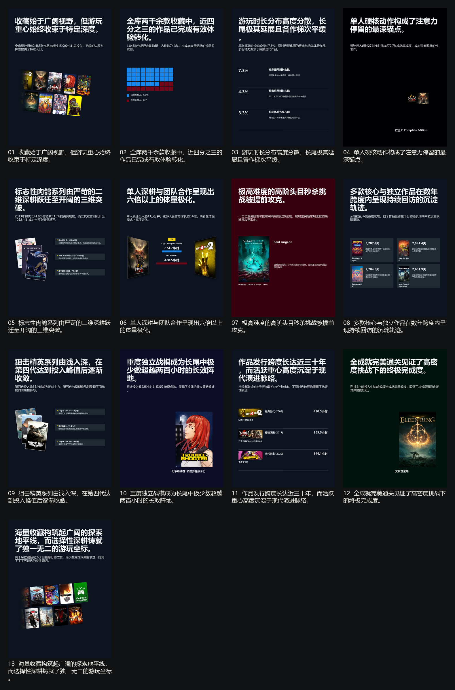

# Steam Visualogue

[English](README.md)

挖掘 Steam 游玩历史中的有趣数据，转化为图文并茂的卡片。

输出示例：



---

## 前置准备与配置

### 1. Steam Web API Key
1. 从 [Steam 社区开发者门户](https://steamcommunity.com/dev/apikey) 获取 API Key（域名填 `localhost` 即可）。
2. 在仓库根目录创建 `.steam-visualogue.env` 文件：
   ```env
   STEAM_API_KEY=your_32_character_api_key_here
   ```

### 2. 安装 Python 依赖
要求 Python 3.10+。运行以下命令安装依赖：

```bash
pip install -r .agents/skills/steam-visualogue/scripts/requirements.txt
```

---

## 提示词示例

只需向你的 Agent 发送类似如下提示词：

  > *"为用户 `XXXXX`（填入你的 Steam ID 或个人主页链接）生成一份中文版的 Steam Visualogue 报告。"*

Agent 将自动执行数据分析、选题策划、色板提取、卡片渲染与质量校验，并将最终生成的成套卡片与索引图输出至 `output/<run-name>/`。
